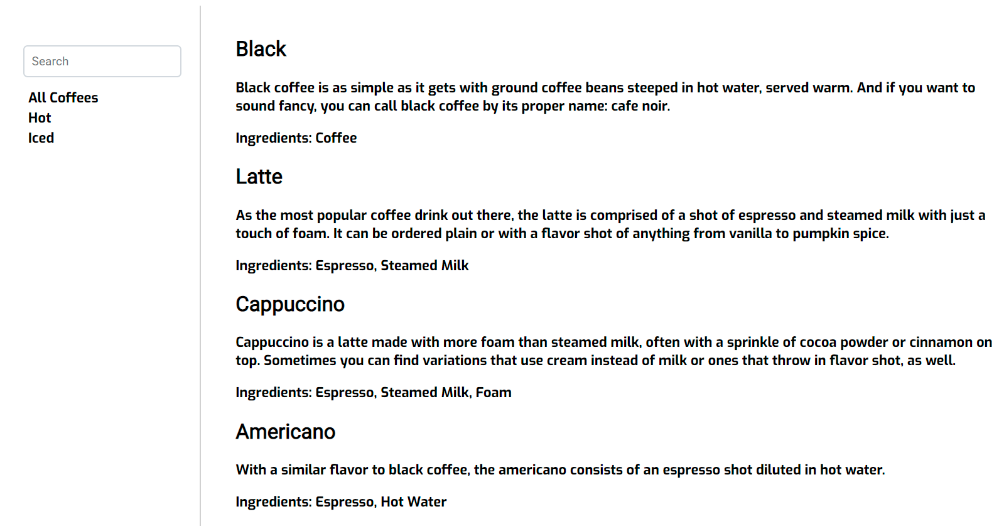
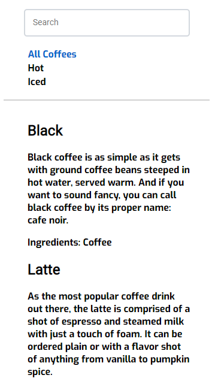

# Coffee App - [Live](https://yhertekin-coffee-app.surge.sh/)

This project was given by Kloia's bootcamp as a final case problem.

- View coffees available within the system.
- View coffee categories available within the system. (hot|iced)
- Filter coffees with a free-form text input.
- Choose a coffee category to filter visible coffees.

## Desktop

## Mobile

## To run this project

In the project directory, you can run:

### `yarn start`

Runs the app in the development mode.\
Open [http://localhost:3000](http://localhost:3000) to view it in the browser.

The page will reload if you make edits.\
You will also see any lint errors in the console.
